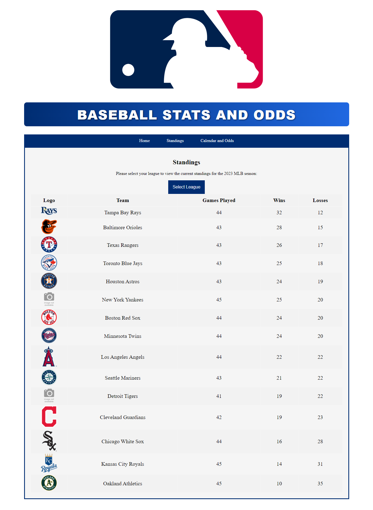
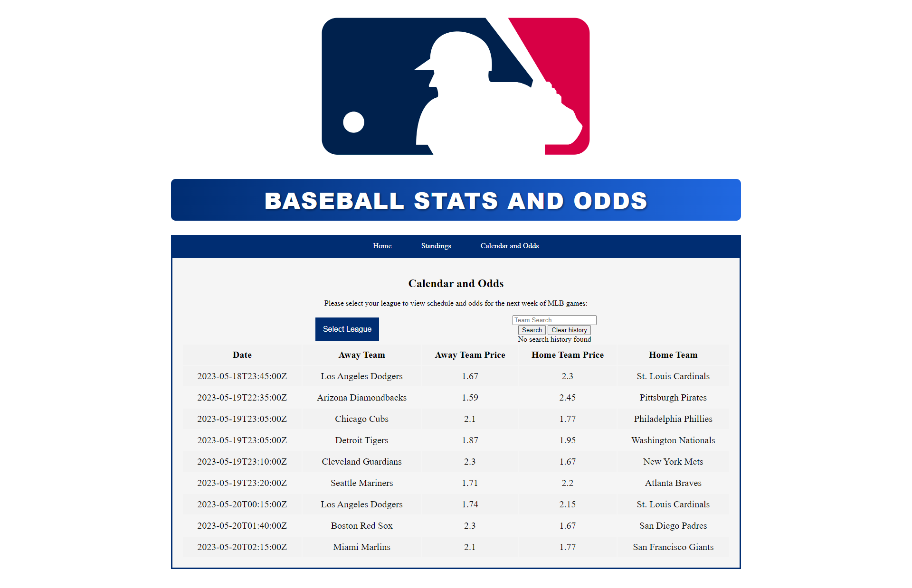
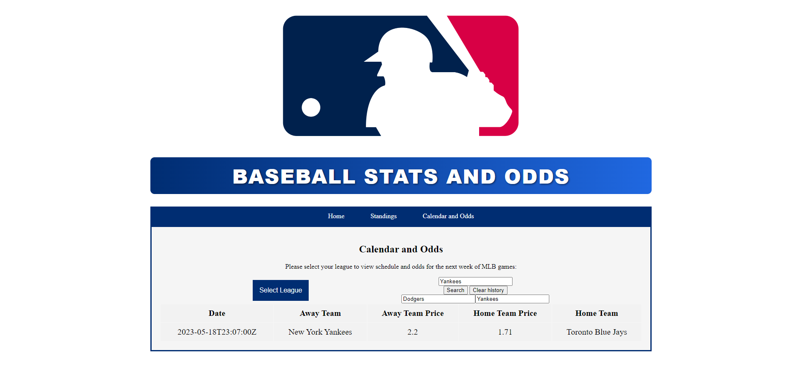

# baseball_statsandodds
Project 1 collaborative
This baseball webpage, provides users the opportunity to check current stats and odds for the ongoing MLB season. "Baseball Stats and Odds", is a collaborative project by Jacques Scoffoni, Lee Amick and Gregory Williams. Several tools were utilized to bring this website to life, which included using Javascript code to access the information desired, from the API feature available on dashboard.api-football.com. Other tools used and steps taken were:
* Usage Semantic HTML elements
* CSS combined with JavaScript to set appearance
* Javascript to collect and store data in local storage
* Timely commits to GitHub repository to save work
* Deployed webpage

It displays on one page the standings for a division specified from a dropdown menu using a sports API, on another the upcoming games and odds in a specific division using an Odds 
API as well as the upcoming games for a specific team defined in a search bar, which also stores the previous searches in local memory.

# Your Task
Working on this API fueled baseball webpage, provided us with the opportunity to not only get more experience with eventListeners, jquery, but also gain an abundance of knowledge, in the usage and coding to add and use APIs from open source websites.

# Deployed Site and repository
* <a href="https://jako0320.github.io/baseball_statsandodds/">Deployed Baseball Stats and Odds</a>
* <a href="https://github.com/Jako0320/baseball_statsandodds">Baseball Stats and Odds Repository</a>

# Screenshots

# Installation
An API from <a href="https://dashboard.api-football.com/">dashboard.api-football.com</a> was used attain real time baseball stats and odds.
An API from <a href="https://rapidapi.com/theoddsapi/api/live-sports-odds/">

# Usage
The baseball odds and stats webpage allows users to check the stats and odds of teams and games.

# Credits
* Jacques Scoffoni (Developer)
* Lee Amick (Developer)
* Gregory Williams (Developer)
* Columbia Engineering Bootcamp resources (including Tim Crum and Laura Cole)
* <a href="https://dashboard.api-football.com/">dashboard.api-football.com</a>
* <a href="https://www.w3schools.com/">w3schools website</a>
* <a href="https://developer.mozilla.org/en-US/">MND webdocs</a>
* <a href="https://stackoverflow.com">Stackoverflow</a>